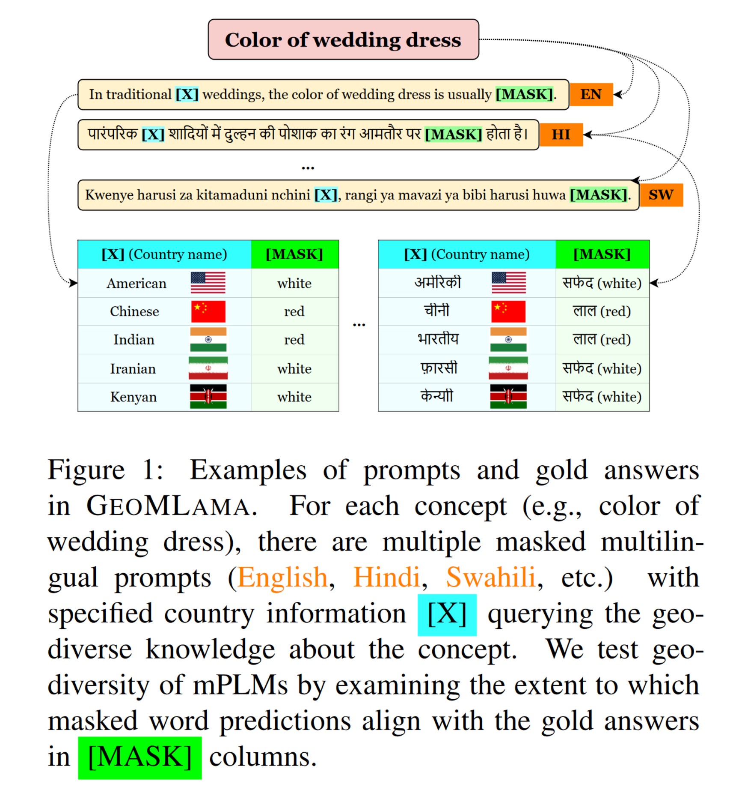

# GeoMLAMA

Code for [*GeoMLAMA: Geo-Diverse Commonsense Probing on Multilingual Pre-Trained Language Models*](https://arxiv.org/abs/2205.12247) (EMNLP 2022).

<p align="center">
    
</p>

## Research Questions and Aims:
1. How much geo-diverse commonsense knowledge is learned by multilingual pre-trained language models (mPLMs)?
2. Does the model size necessarily imply better geographical inclusivity of mPLMs? Are all the mPLMs biased towards simply learning commonsense about US? To probe probe commonsense of one country, is the best language the native language of that country, and vice versa? What are the reasons behind it?

GeoMLAMA is a very easy-to-use benchmark and code to do the aforementioned analysis.

## GeoMLAMA Data
All the files with ".tsv" contain prompts in GeoMLAMA. The files with "_aug.tsv" store the prompts that are translated and paraphrased for obtain more robust results.

## Commands
We just need a single command to start the evaluation!
```
python test_mlm_w_mask.py -lang [LANG] -mname [MODEL NAME] -country_or_not [COUNTRY_OR_NOT]
```

`[LANG]` is the tested language. It can be one of `en` (English), `zh` (Chinese), `hi` (Hindi), `fa` (Persian), and `sw` (Swahili).

`[MODEL NAME]` is the tested mPLM. It can be any model name noted in `test_mlm_w_mask.py`.

`[COUNTRY_OR_NOT]` is whether you want to add country information in the prompts or not. If you don't add country information, the code will be used to study the intrinsic bias of mPLMs without prior information of any country. It can be either `yes` or `no`.

## Acknowledgement
We thank for implementation of Huggingface Transformers.

## Citation
Please cite our EMNLP paper if this repository inspired your work.
```
@inproceedings{yin2022geomlama,
  title = {GeoMLAMA: Geo-Diverse Commonsense Probing on Multilingual Pre-Trained Language Models},
  author = {Yin, Da and Bansal, Hritik and Monajatipoor, Masoud and Li, Liunian Harold and Chang, Kai-Wei},
  booktitle = {EMNLP},
  year = {2022}
}
```
